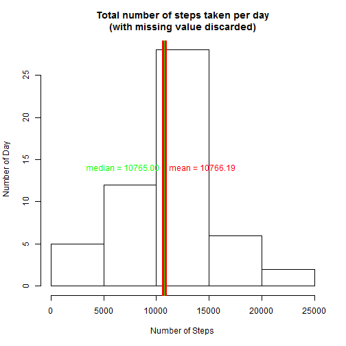
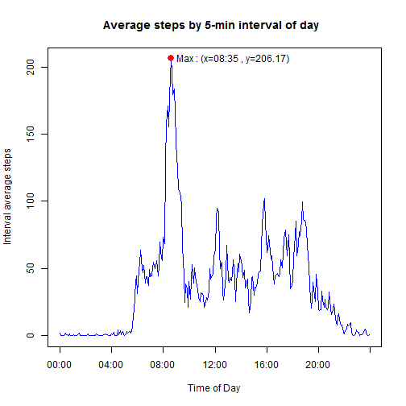
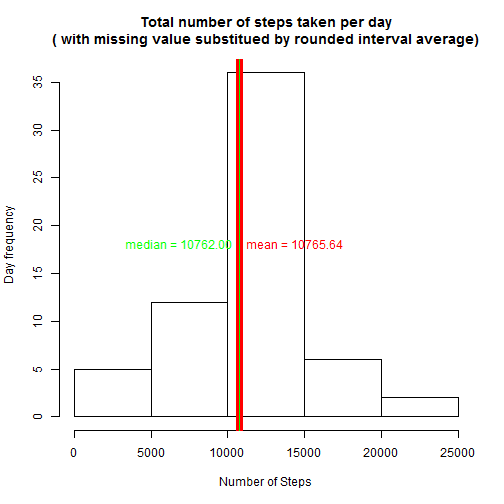
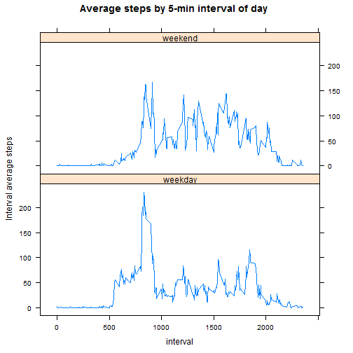

_**Note:** This analysis uses_ **lattice**_,_ **lubridate**_,_ **dplyr** _and_ **xtable** _packages_


```r
## setting up the session
library(lubridate)
library(xtable)
library(dplyr)
library(lattice)
```
## Loading and preprocessing the data


```r
a <- read.csv("activity.csv", colClasses = c("integer", "Date", "integer"))
```

```r
dim_a <- dim(a)
variables <- dim_a[2]
obs <- dim_a[1]

steps_NA <- length(which(is.na(a$steps)))
steps_Valid <- length(which(!is.na(a$steps)))

date_NA <- length(which(is.na(a$date)))
date_Valid <- length(which(!is.na(a$date)))

interval_NA <- length(which(is.na(a$interval)))
interval_Valid <- length(which(!is.na(a$interval)))

aNA <- data.frame(c(steps_NA, date_NA, interval_NA), c(steps_Valid, date_Valid, interval_Valid))
colnames(aNA) <- c("NAs", "Valid")
rownames(aNA) <- names(a)

xt <- xtable(aNA, caption = "Statistics of NA in each variable")
```
There are **17568** observations with **3** variables named  **{ steps, date, interval }**. 

<!-- html table generated in R 3.2.1 by xtable 1.7-4 package -->
<!-- Sun Jul 12 15:58:38 2015 -->
<table border=1>
<caption align="bottom"> Statistics of NA in each variable </caption>
<tr> <th>  </th> <th> NAs </th> <th> Valid </th>  </tr>
  <tr> <td align="right"> steps </td> <td align="right"> 2304 </td> <td align="right"> 15264 </td> </tr>
  <tr> <td align="right"> date </td> <td align="right">   0 </td> <td align="right"> 17568 </td> </tr>
  <tr> <td align="right"> interval </td> <td align="right">   0 </td> <td align="right"> 17568 </td> </tr>
   </table>
We filter out all observations with **steps** == **NA** into **tbl_df** type. **dta** will be the clean data we work on from now to answer the questions.


```r
#filtering out NA from dataset
dta <- tbl_df(a[!is.na(a$steps),])
#work on dta from now on
dta
```

```
## Source: local data frame [15,264 x 3]
## 
##    steps       date interval
## 1      0 2012-10-02        0
## 2      0 2012-10-02        5
## 3      0 2012-10-02       10
## 4      0 2012-10-02       15
## 5      0 2012-10-02       20
## 6      0 2012-10-02       25
## 7      0 2012-10-02       30
## 8      0 2012-10-02       35
## 9      0 2012-10-02       40
## 10     0 2012-10-02       45
## ..   ...        ...      ...
```


## What is mean total number of steps taken per day?
###Analysis Objective

we would like to understand the following :

1. The total number of steps taken per day
2. The histogram of the total number of steps taken each day
3. The mean and median of the total number of steps taken per day

###Calculating the total steps taken each day, and, its mean and median 


```r
# using dplyr to group the data
daysteps <- dta %>% group_by(date) %>% summarise(day_steps=sum(steps))
daysteps # visual verification
```

```
## Source: local data frame [53 x 2]
## 
##          date day_steps
## 1  2012-10-02       126
## 2  2012-10-03     11352
## 3  2012-10-04     12116
## 4  2012-10-05     13294
## 5  2012-10-06     15420
## 6  2012-10-07     11015
## 7  2012-10-09     12811
## 8  2012-10-10      9900
## 9  2012-10-11     10304
## 10 2012-10-12     17382
## ..        ...       ...
```

```r
# mean of the daily total steps
day_mean <- format(round(mean(daysteps$day_steps),2), nsmall=2)
day_mean
```

```
## [1] "10766.19"
```

```r
# median of the daily total steps
day_median <- format(round(median(daysteps$day_steps), 2), nsmall=2)
day_median
```

```
## [1] "10765.00"
```
The mean of the total number of steps taken per day is **10766.19** and the median of the total number of steps taken per day is **10765.00**

### The histogram of the total number of steps taken each day .

```r
# histogram of total steps per day
param_hist <-hist(daysteps$day_steps, 
                  main="Total number of steps taken per day\n(with missing value discarded)", 
                  xlab = "Number of Steps", 
                  ylab="Number of Day "
                  )
# draw man line
abline(v=day_mean, col="red", lwd=7 )
mid_range = max(param_hist$counts)/2
text(x=day_mean, y=mid_range, paste("mean =", day_mean), pos=4, col = "red")

# draw median line
abline(v=day_median, col="green", lwd=1)
text(x=day_median, y=mid_range, paste("median =", day_median), pos=2, col = "green")
```

 

## What is the average daily activity pattern?

###Analysis Objective

We would like to understand the activity pattern based on the time of day. Therefore, we will compute the average steps within the same 5-minute interval from different days to discern the pattern.

**Note:** _There are **288** _5-minutes interval_ per day. The interval notation in the dataset is actually the (hour){minute} of the day in integer format. T he first interval of the day is noted 0 and last interval of the day is noted 2355. We will first format the interval to be in the notation hh:mm.

###Analysis 


```r
# calculate the interval average usig dplyr
interval_average <- dta %>% group_by(interval) %>% summarise(interval.average.steps = mean(steps))
# change to character type to allow string manipulation
interval_average$interval <- as.character(interval_average$interval)
#add new variable to store the new time format
interval_average$timeofday <- interval_average$interval

# set interval width to be 4 characters by prepading with sufficient zeros (5 ==> 0005 )
for (x in 3:1) {
    zero_prefix <- paste(rep("0", 4-x), collapse='') 
    interval_average$timeofday[nchar(interval_average$interval)==x]<-
                paste0(zero_prefix,interval_average$interval[nchar(interval_average$interval)==x])
}

# insert ":" between the hhmm to become hh:mm for readability purpose
interval_average$timeofday = gsub('^([0-9]{2})([0-9]+)$', '\\1:\\2',interval_average$timeofday)
interval_average
```

```
## Source: local data frame [288 x 3]
## 
##    interval interval.average.steps timeofday
## 1         0              1.7169811     00:00
## 2         5              0.3396226     00:05
## 3        10              0.1320755     00:10
## 4        15              0.1509434     00:15
## 5        20              0.0754717     00:20
## 6        25              2.0943396     00:25
## 7        30              0.5283019     00:30
## 8        35              0.8679245     00:35
## 9        40              0.0000000     00:40
## 10       45              1.4716981     00:45
## ..      ...                    ...       ...
```
We identify the interval of which the average steps is maximum 


```r
max_average <- interval_average[interval_average$interval.average.steps==max(interval_average$interval.average.steps),]
max_average
```

```
## Source: local data frame [1 x 3]
## 
##   interval interval.average.steps timeofday
## 1      835               206.1698     08:35
```

```r
max_pos <- which(interval_average$interval==max_average$interval)
```
The maximum value is **206.1698113**  found at interval **835** corresponding to time **08:35**. This interval is the **104-th** 5-minute interval of the day.

### The activity pattern

The activity pattern for each 5-minute interval is shown in the plot below

```r
#plot the pattern with x-axis interval of 4 hours
plot(x=seq_along(interval_average$interval), 
     y=interval_average$interval.average.steps,  
     type="l", 
     xaxt="n", 
     xlab = "Time of Day", 
     ylab = "Interval average steps", 
     main = "Average steps by 5-min interval of day  ", 
     col="blue",
     lwd=1)

axis_show = seq(1,(24*60/5)+1, by=4*12) # setup 4 hours axis tick, the extra 1 is to show the 24:00
axis(1, at=axis_show, labels=interval_average$timeofday[axis_show]) # show axis with proper hour label spaced by 4 hours

points(max_pos, max_average$interval.average.steps, col="red", pch=21, bg="red", cex=1.5 )

text(x=max_pos, 
     y=max_average$interval.average.steps, 
     paste0("Max : (x=", max_average$timeofday,
            " , y=", format(
                        round(max_average$interval.average.steps,2),
                        nsmall=2
                    ),
            ")"
            ), 
     pos=4 )
```

 


## Imputing missing values

###Analysis Objective
We would like to understand the effect of imputing the missing data to the analysis results

###Calculating the new values

As highlighted early in this report, the NAs have been identified as per table below. The values represent the number of rows of which the data is missing. Only **steps** has missing data. The previous analysis has discarded the missing data observation.

<!-- html table generated in R 3.2.1 by xtable 1.7-4 package -->
<!-- Sun Jul 12 15:58:38 2015 -->
<table border=1>
<caption align="bottom"> Statistics of NA in each variable </caption>
<tr> <th>  </th> <th> NAs </th> <th> Valid </th>  </tr>
  <tr> <td align="right"> steps </td> <td align="right"> 2304 </td> <td align="right"> 15264 </td> </tr>
  <tr> <td align="right"> date </td> <td align="right">   0 </td> <td align="right"> 17568 </td> </tr>
  <tr> <td align="right"> interval </td> <td align="right">   0 </td> <td align="right"> 17568 </td> </tr>
   </table>
To use full set of data, we can fill in the missing values with the rounded value of 5-min interval average since steps are integer by nature.

We create new dataset **f_a** with full set of data


```r
#merging original dataset with the interval_average into new dplyr variable **t_a**
f_a <- tbl_df(merge(a, interval_average, by = "interval"))
f_a # table with missing data
```

```
## Source: local data frame [17,568 x 5]
## 
##    interval steps       date interval.average.steps timeofday
## 1         0    NA 2012-10-01               1.716981     00:00
## 2         0     0 2012-11-23               1.716981     00:00
## 3         0     0 2012-10-28               1.716981     00:00
## 4         0     0 2012-11-06               1.716981     00:00
## 5         0     0 2012-11-24               1.716981     00:00
## 6         0     0 2012-11-15               1.716981     00:00
## 7         0     0 2012-10-20               1.716981     00:00
## 8         0     0 2012-11-16               1.716981     00:00
## 9         0     0 2012-11-07               1.716981     00:00
## 10        0     0 2012-11-25               1.716981     00:00
## ..      ...   ...        ...                    ...       ...
```

```r
# set steps value = interval.average.step where steps is NA
f_a$steps[is.na(f_a$steps)] = round(f_a$interval.average.steps[is.na(f_a$steps)])
f_a # table with missing data substituted with the interval average
```

```
## Source: local data frame [17,568 x 5]
## 
##    interval steps       date interval.average.steps timeofday
## 1         0     2 2012-10-01               1.716981     00:00
## 2         0     0 2012-11-23               1.716981     00:00
## 3         0     0 2012-10-28               1.716981     00:00
## 4         0     0 2012-11-06               1.716981     00:00
## 5         0     0 2012-11-24               1.716981     00:00
## 6         0     0 2012-11-15               1.716981     00:00
## 7         0     0 2012-10-20               1.716981     00:00
## 8         0     0 2012-11-16               1.716981     00:00
## 9         0     0 2012-11-07               1.716981     00:00
## 10        0     0 2012-11-25               1.716981     00:00
## ..      ...   ...        ...                    ...       ...
```

```r
f_daysteps <- f_a %>% group_by(date) %>% summarise(day_steps = sum(steps))
f_daysteps
```

```
## Source: local data frame [61 x 2]
## 
##          date day_steps
## 1  2012-10-01     10762
## 2  2012-10-02       126
## 3  2012-10-03     11352
## 4  2012-10-04     12116
## 5  2012-10-05     13294
## 6  2012-10-06     15420
## 7  2012-10-07     11015
## 8  2012-10-08     10762
## 9  2012-10-09     12811
## 10 2012-10-10      9900
## ..        ...       ...
```

```r
f_day_mean <- format(round(mean(f_daysteps$day_steps),2), nsmall=2)
f_day_mean 
```

```
## [1] "10765.64"
```

```r
f_day_median <- format(round(median(f_daysteps$day_steps), 2), nsmall=2)
f_day_median
```

```
## [1] "10762.00"
```
* The mean of the total number of steps taken per day when the missing data is replaced as described is **10765.64** and the median of the total number of steps taken per day is **10762.00**
* To recall, the mean of the total number of steps taken per day when the missing data is discarded as calculated earlier was  **10766.19** and the median of the total number of steps taken per day was **10765.00**

###Histograms of thetotal number of steps taken each day

The histograms are shown below.

#### With missing value substituted with interval average value

```r
# draw new histogram
f_param_hist <-hist(f_daysteps$day_steps, 
                    main="Total number of steps taken per day\n( with missing value substitued by rounded interval average)",
                    xlab = "Number of Steps", 
                    ylab="Day frequency"
                    )
#draw new mean line
abline(v=f_day_mean, col="red", lwd=7 )
f_mid_range = max(f_param_hist$counts)/2
text(x=f_day_mean, y=f_mid_range, paste("mean =", f_day_mean), pos=4, col = "red")

#draw new median line
abline(v=f_day_median, col="green", lwd=1)
text(x=f_day_median, y=f_mid_range, paste("median =", f_day_median), pos=2, col = "green")
```

 

#### <span style="color:blue">[For Reference]</span> With missing values discarded as calculated earlier

 

####Observations

The mean seems to be slightly affected since we have rounded the steps during substitution. However, number of date increased from 53 to 61 which means that there were days without observations. This can be observed with the following code.


```r
# dataset with missing values discarded
param_hist$counts
```

```
## [1]  5 12 28  6  2
```

```r
#dataset with missing values replaced with interval average 
f_param_hist$counts
```

```
## [1]  5 12 36  6  2
```
Since the new population use steps very close to the interval average (due to the **round** operation), the new populations are close to the mean total daily steps. This can be observed in the histograms above.

As the median of the total daily steps were close to the mean daily steps, the new populations is also close to the median of the total daily steps when the missing data was discarded. This can be observed in the histograms above.

The new mean and median are affected due to the **rounding operations**.

## Are there differences in activity patterns between weekdays and weekends?

###Analysis objective

We are using the full dataset where the missing values are replaced with the interval average. We would like to see whether the activity changes between different period of the week : { **weekdays** | **weekend** }

###Analysis

The full dataset is expanded to include the period of the week indicator. The interval mean steps are then compared between the two period.


```r
# add day of week
wfa <- mutate(f_a, dayofweek = weekdays(date), isWeekend = (dayofweek=="Sunday" | dayofweek=="Saturday"))

# flag weekend or weekdays for each observation
wfa$period.of.week[wfa$isWeekend] = "weekend"
wfa$period.of.week[!wfa$isWeekend] = "weekday"

#create summary of dataset by period of week and interval.
pow_wfa <- wfa %>% group_by(period.of.week, interval) %>% summarize(interval.mean.step=mean(steps))
pow_wfa
```

```
## Source: local data frame [576 x 3]
## Groups: period.of.week
## 
##    period.of.week interval interval.mean.step
## 1         weekday        0         2.28888889
## 2         weekday        5         0.40000000
## 3         weekday       10         0.15555556
## 4         weekday       15         0.17777778
## 5         weekday       20         0.08888889
## 6         weekday       25         1.57777778
## 7         weekday       30         0.75555556
## 8         weekday       35         1.15555556
## 9         weekday       40         0.00000000
## 10        weekday       45         1.73333333
## ..            ...      ...                ...
```

```r
# Compare the two period via lattice plot system
xyplot(interval.mean.step~interval | period.of.week, 
       data=pow_wfa, 
       type="l", 
        ylab = "Interval average steps", 
       main = "Average steps by 5-min interval of day  ",        
       layout=c(1,2))
```

 

#### Observation
There is an intense activity at around 8am during the weekdays. This may be due to the rush hour to the workplace. The activity start very early in the morning at around 5am in weekdays. The activity are quite low between 10am to 4pm except for lunch break around 12-1pm. The activity gets slightly high at 4pm and again at 6pm. This may be due to the final rush to finish work and to have dinner respectively. Weekdays nighttime is quite calm.

During the weekend, the day starts much later at around 8am. The activity remains high throughout the day and ends slightly later compared to weekdays. The activity envelop during weekends is higher than weekdays except for the morning rush.
