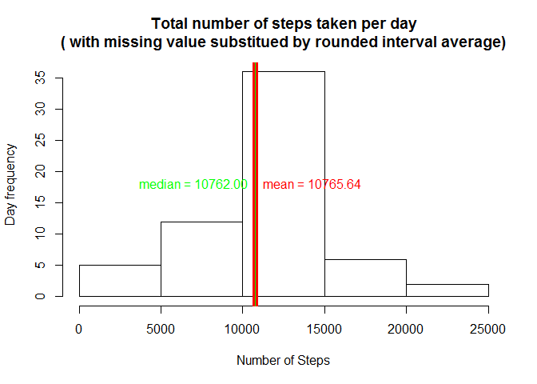

# Reproducible Research: Peer Assessment 1

_**Note:** This analysis uses_ **lattice**_,_ **lubridate**_,_ **dplyr** _and_ **xtable** _packages_


## Loading and preprocessing the data


```r
a <- read.csv("activity.csv", colClasses = c("integer", "Date", "integer"))
```

There are **17568** observations with **3** variables named  **{ steps, date, interval }**. 

<!-- html table generated in R 3.2.1 by xtable 1.7-4 package -->
<!-- Sun Jul 12 04:33:52 2015 -->
<table border=1>
<caption align="bottom"> Statistics of NA in each variable </caption>
<tr> <th>  </th> <th> NAs </th> <th> Valid </th>  </tr>
  <tr> <td align="right"> steps </td> <td align="right"> 2304 </td> <td align="right"> 15264 </td> </tr>
  <tr> <td align="right"> date </td> <td align="right">   0 </td> <td align="right"> 17568 </td> </tr>
  <tr> <td align="right"> interval </td> <td align="right">   0 </td> <td align="right"> 17568 </td> </tr>
   </table>
We filter out all observations with **steps** == **NA** into **tbl_df** type._ **dta** _will be the clean data we work on from now to answer the questions.


```r
dta <- tbl_df(a[!is.na(a$steps),])
dta
```

```
## Source: local data frame [15,264 x 3]
## 
##    steps       date interval
## 1      0 2012-10-02        0
## 2      0 2012-10-02        5
## 3      0 2012-10-02       10
## 4      0 2012-10-02       15
## 5      0 2012-10-02       20
## 6      0 2012-10-02       25
## 7      0 2012-10-02       30
## 8      0 2012-10-02       35
## 9      0 2012-10-02       40
## 10     0 2012-10-02       45
## ..   ...        ...      ...
```


## What is mean total number of steps taken per day?


```r
daysteps <- dta %>% group_by(date) %>% summarise(sum(steps))
colnames(daysteps) <- c("date", "day_steps")
daysteps
```

```
## Source: local data frame [53 x 2]
## 
##          date day_steps
## 1  2012-10-02       126
## 2  2012-10-03     11352
## 3  2012-10-04     12116
## 4  2012-10-05     13294
## 5  2012-10-06     15420
## 6  2012-10-07     11015
## 7  2012-10-09     12811
## 8  2012-10-10      9900
## 9  2012-10-11     10304
## 10 2012-10-12     17382
## ..        ...       ...
```

```r
day_mean <- format(round(mean(daysteps$day_steps),2), nsmall=2)
day_mean
```

```
## [1] "10766.19"
```

```r
day_median <- format(round(median(daysteps$day_steps), 2), nsmall=2)
day_median
```

```
## [1] "10765.00"
```
The mean of the total number of steps taken per day is 10766.19 and the median of the total number of steps taken per day is 10765.00

### The histogram of the total number of steps taken each day .

```r
param_hist <-hist(daysteps$day_steps, main="Total number of steps taken per day\n( with missing value discarded)", 
                        xlab = "Number of Steps", ylab="Day frequency")

abline(v=day_mean, col="red", lwd=7 )
mid_range = max(param_hist$counts)/2
text(x=day_mean, y=mid_range, paste("mean =", day_mean), pos=4, col = "red")
abline(v=day_median, col="green", lwd=1)
text(x=day_median, y=mid_range, paste("median =", day_median), pos=2, col = "green")
```

 

## What is the average daily activity pattern?

We would like to understand the activity pattern for each of the 5-minute interval. We would compare the daily average steps during the same interval.

**Note:** _There are **288** _5-minutes interval_ per day. The interval notation is actually the (hour){minute) of the day. T he first interval of the day is noted 0 and last interval of the day is noted 2355. We will first format the interval to be in the notation hh:mm.


```r
interval_average <- dta %>% group_by(interval) %>% summarise(mean(steps))
colnames(interval_average) <- c("interval", "interval.average.steps")
# change to character type to allow string manipulation
interval_average$interval = as.character(interval_average$interval)
interval_average$timeofday = interval_average$interval

#prepad interval with leading zeros

for (x in 3:1) {
    interval_average$timeofday[nchar(interval_average$interval)==x]<-
        paste0(paste(rep("0", 4-x), collapse=''),interval_average$interval[nchar(interval_average$interval)==x])
}
# insert ":" between the hhmm to become hh:mm for readability purpose
interval_average$timeofday = gsub('^([0-9]{2})([0-9]+)$', '\\1:\\2',interval_average$timeofday)
interval_average
```

```
## Source: local data frame [288 x 3]
## 
##    interval interval.average.steps timeofday
## 1         0              1.7169811     00:00
## 2         5              0.3396226     00:05
## 3        10              0.1320755     00:10
## 4        15              0.1509434     00:15
## 5        20              0.0754717     00:20
## 6        25              2.0943396     00:25
## 7        30              0.5283019     00:30
## 8        35              0.8679245     00:35
## 9        40              0.0000000     00:40
## 10       45              1.4716981     00:45
## ..      ...                    ...       ...
```
We localize the interval of which the average steps is maximum 

```r
max_average <- interval_average[interval_average$interval.average.steps==max(interval_average$interval.average.steps),]
max_average
```

```
## Source: local data frame [1 x 3]
## 
##   interval interval.average.steps timeofday
## 1      835               206.1698     08:35
```

```r
max_pos <- which(interval_average$interval==max_average$interval)
```
The maximum value of 206.1698113 is found at interval **835**. This interval is the **104-th** 5-minute interval of the day.

### The activity pattern for each 5-minute interval is shown in the plot below

```r
#plot the pattern with x-axis interval of 4 hours
plot(x=seq_along(interval_average$interval), 
     y=interval_average$interval.average.steps,  
     type="l", 
     xaxt="n", 
     xlab = "Time of Day", 
     ylab = "Interval average steps", 
     main = "Average steps by 5-min interval of day  ", 
     lwd=3)

axis_show = seq(1,(24*60/5)+1, by=4*12) # setup 4 hours axis tick, the extra 1 is to show the 24:00
axis(1, at=axis_show, labels=interval_average$timeofday[axis_show]) # show axis with proper hour label spaced by 4 hours

abline(v=max_pos, col="red", lwd=1 )
abline(h=max_average$interval.average.steps, col="red", lwd=1 )

text(x=max_pos, y=max_average$interval.average.steps, paste0("(x=",max_average$timeofday,", y=",format(round(max_average$interval.average.steps,2), nsmall=2),")"), pos=4 )
```

 


## Imputing missing values

As highlighted early in this report, the NAs identified as per table below. The values represent the number of rows of which the data is missing. Only **steps** has missing data. The previous analysis has discarded the missing data observation

<!-- html table generated in R 3.2.1 by xtable 1.7-4 package -->
<!-- Sun Jul 12 04:33:52 2015 -->
<table border=1>
<caption align="bottom"> Statistics of NA in each variable </caption>
<tr> <th>  </th> <th> NAs </th> <th> Valid </th>  </tr>
  <tr> <td align="right"> steps </td> <td align="right"> 2304 </td> <td align="right"> 15264 </td> </tr>
  <tr> <td align="right"> date </td> <td align="right">   0 </td> <td align="right"> 17568 </td> </tr>
  <tr> <td align="right"> interval </td> <td align="right">   0 </td> <td align="right"> 17568 </td> </tr>
   </table>
To use full set of data, we can imputing the missing values with the 5-min interval average.
We create new dataset **f_a** with full set of data


```r
#merging original dataset with the interval_average into new variable **t_a**
f_a <- tbl_df(merge(a, interval_average, by = "interval"))
f_a
```

```
## Source: local data frame [17,568 x 5]
## 
##    interval steps       date interval.average.steps timeofday
## 1         0    NA 2012-10-01               1.716981     00:00
## 2         0     0 2012-11-23               1.716981     00:00
## 3         0     0 2012-10-28               1.716981     00:00
## 4         0     0 2012-11-06               1.716981     00:00
## 5         0     0 2012-11-24               1.716981     00:00
## 6         0     0 2012-11-15               1.716981     00:00
## 7         0     0 2012-10-20               1.716981     00:00
## 8         0     0 2012-11-16               1.716981     00:00
## 9         0     0 2012-11-07               1.716981     00:00
## 10        0     0 2012-11-25               1.716981     00:00
## ..      ...   ...        ...                    ...       ...
```

```r
# set steps value = interval.average.step where steps is NA
f_a$steps[is.na(f_a$steps)] = f_a$interval.average.steps[is.na(f_a$steps)]
f_a
```

```
## Source: local data frame [17,568 x 5]
## 
##    interval    steps       date interval.average.steps timeofday
## 1         0 1.716981 2012-10-01               1.716981     00:00
## 2         0 0.000000 2012-11-23               1.716981     00:00
## 3         0 0.000000 2012-10-28               1.716981     00:00
## 4         0 0.000000 2012-11-06               1.716981     00:00
## 5         0 0.000000 2012-11-24               1.716981     00:00
## 6         0 0.000000 2012-11-15               1.716981     00:00
## 7         0 0.000000 2012-10-20               1.716981     00:00
## 8         0 0.000000 2012-11-16               1.716981     00:00
## 9         0 0.000000 2012-11-07               1.716981     00:00
## 10        0 0.000000 2012-11-25               1.716981     00:00
## ..      ...      ...        ...                    ...       ...
```

```r
f_daysteps <- f_a %>% group_by(date) %>% summarise(sum(steps))
colnames(f_daysteps) <- c("date", "day_steps")
f_daysteps
```

```
## Source: local data frame [61 x 2]
## 
##          date day_steps
## 1  2012-10-01  10766.19
## 2  2012-10-02    126.00
## 3  2012-10-03  11352.00
## 4  2012-10-04  12116.00
## 5  2012-10-05  13294.00
## 6  2012-10-06  15420.00
## 7  2012-10-07  11015.00
## 8  2012-10-08  10766.19
## 9  2012-10-09  12811.00
## 10 2012-10-10   9900.00
## ..        ...       ...
```

```r
f_day_mean <- format(round(mean(f_daysteps$day_steps),2), nsmall=2)
f_day_mean
```

```
## [1] "10766.19"
```

```r
f_day_median <- format(round(median(f_daysteps$day_steps), 2), nsmall=2)
f_day_median
```

```
## [1] "10766.19"
```
* The mean of the total number of steps taken per day when the missing data is replaced as described is **10766.19** and the median of the total number of steps taken per day is **10766.19**
* The mean of the total number of steps taken per day is **10766.19** and the median of the total number of steps taken per day is **10765.00**


The histograms are shown below.

### The histogram of the total number of steps taken each day .

#### With missing value substituted with interval average value

```r
f_param_hist <-hist(f_daysteps$day_steps, main="Total number of steps taken per day\n( with missing value substitued by interval average)",
                        xlab = "Number of Steps", ylab="Day frequency")

abline(v=f_day_mean, col="red", lwd=7 )
f_mid_range = max(f_param_hist$counts)/2
text(x=f_day_mean, y=f_mid_range, paste("mean =", f_day_mean), pos=4, col = "red")
abline(v=f_day_median, col="green", lwd=1)
text(x=f_day_median, y=f_mid_range, paste("median =", f_day_median), pos=2, col = "green")
```

 

#### [Reference] With missing values discarded as calculated earlier

 

The mean seems not to be affected. However, number of date increased from 53 to 61 which means that there were days without observations. This can be observed with the following code.


```r
# dataset with missing values discarded
param_hist$counts
```

```
## [1]  5 12 28  6  2
```

```r
#dataset with missing values replaced with interval average 
f_param_hist$counts
```

```
## [1]  5 12 36  6  2
```
As we replaced the missing values with the interval average, the total daily steps is equal to the mean of the total daily steps. However, since the number of dates increased between the two datasets, the median could change. The additions are centered around mean of the total and as the median is very close to the mean, the new median is marginally affected.


## Are there differences in activity patterns between weekdays and weekends?


```r
wfa <- mutate(f_a, dayofweek = weekdays(date), isWeekend = (dayofweek=="Sunday" | dayofweek=="Saturday"))
wfa$period.of.week[wfa$isWeekend] = "weekend"
wfa$period.of.week[!wfa$isWeekend] = "weekday"
arrange(select(wfa, date, dayofweek, period.of.week, interval, timeofday, steps), date, interval)
```

```
## Source: local data frame [17,568 x 6]
## 
##          date dayofweek period.of.week interval timeofday     steps
## 1  2012-10-01    Monday        weekday        0     00:00 1.7169811
## 2  2012-10-01    Monday        weekday        5     00:05 0.3396226
## 3  2012-10-01    Monday        weekday       10     00:10 0.1320755
## 4  2012-10-01    Monday        weekday       15     00:15 0.1509434
## 5  2012-10-01    Monday        weekday       20     00:20 0.0754717
## 6  2012-10-01    Monday        weekday       25     00:25 2.0943396
## 7  2012-10-01    Monday        weekday       30     00:30 0.5283019
## 8  2012-10-01    Monday        weekday       35     00:35 0.8679245
## 9  2012-10-01    Monday        weekday       40     00:40 0.0000000
## 10 2012-10-01    Monday        weekday       45     00:45 1.4716981
## ..        ...       ...            ...      ...       ...       ...
```

```r
pow_wfa <- wfa %>% group_by(period.of.week, interval) %>% summarize(interval.mean.step=mean(steps))
pow_wfa
```

```
## Source: local data frame [576 x 3]
## Groups: period.of.week
## 
##    period.of.week interval interval.mean.step
## 1         weekday        0         2.25115304
## 2         weekday        5         0.44528302
## 3         weekday       10         0.17316562
## 4         weekday       15         0.19790356
## 5         weekday       20         0.09895178
## 6         weekday       25         1.59035639
## 7         weekday       30         0.69266247
## 8         weekday       35         1.13794549
## 9         weekday       40         0.00000000
## 10        weekday       45         1.79622642
## ..            ...      ...                ...
```

```r
library(lattice)
xyplot(interval.mean.step~interval | period.of.week, data=pow_wfa, type="l", layout=c(1,2))
```

 
